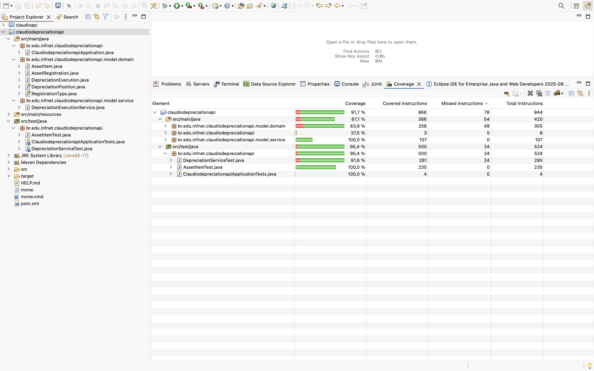

# Feature 1 – Test-Driven Development (TDD)

## Funcionalidade escolhida
Optei por implementar a **execução de depreciação de ativos** (`DepreciationExecutionService`) e o **cálculo do subtotal do ativo** (`AssetItem`).  
Essa decisão foi tomada porque ambas as funcionalidades representam o **núcleo da lógica de negócio** do sistema de Gestão de Ativos Corpóreos:  
- O `AssetItem` garante a correta associação entre cada ativo registrado (`AssetRegistration`) e sua quantidade, possibilitando o cálculo consistente do **subtotal depreciável**.  
- O `DepreciationExecutionService` consolida esses subtotais e gerencia a **execução da depreciação**, validando integridade mínima, aplicando ajustes extraordinários e fornecendo o valor total da depreciação executada.

##### Dessa forma, a funcionalidade conecta de maneira direta a base de cadastro de ativos (`AssetRegistration`) com os processos de cálculo e controle de depreciação (`DepreciationExecution`), estabelecendo a base para os demais módulos do sistema.
---

## Classes criadas
- **Modelos:**
  - `DepreciationPosition`: enum que representa a situação atual do ativo (se já foi depreciado, se está em processo de depreciação, etc.).
  - `RegistrationType`: enum que representa a forma como o ativo foi reconhecido na empresa (novo, aquisição, doação, transferência, impairment test).

- **Test:**
  - `AssetItemTest`: classe de teste unitário que valida o **cálculo do subtotal de depreciação** no `AssetItem`, cobrindo cenários de integridade como quantidade nula/negativa, arredondamento e casos válidos.  
  - `DepreciationServiceTest`: classe de teste unitário focada no `DepreciationExecutionService`, garantindo a **correção da soma de ativos, aplicação de ajustes extraordinários** e a **validação mínima da execução** de depreciação.

## Classes herdadas/aproveitadas
- `AssetRegistration`: cadastro básico de um ativo (código, nome, valor de aquisição, tipo de registro).  
- `AssetItem`: representa a associação entre um ativo e a quantidade depreciada.

## Classe Principal e Serviço
- **Principal:**  
  - `DepreciationExecution`: execução de depreciação, contendo itens, responsável e status.  
- **Serviço:**  
  - `DepreciationExecutionService`: responsável por calcular o valor total da execução de depreciação do ativo, aplicar ajustes extraordinários e validar a integridade básica da execução.

---

## Cenários de Teste (JUnit 5)
Foram implementados testes com **JUnit Jupiter**, localizados em `src/test/java` e seguindo a mesma estrutura de pacotes.

### `AssetItemTest`
1. **Deve realizar o cálculo do subtotal para o ativo válido**  
   - **Objetivo:** verificar se a multiplicação do valor de aquisição pela quantidade retorna o subtotal correto.  
   - **Ciclo:** RED (teste falhou pois método não existia) → GREEN (implementado cálculo) → REFACTOR (limpeza de duplicações).

2. **Deve lançar IllegalArgumentException quando a quantidade for negativa**  
   - **Objetivo:** validar regra de integridade que impede quantidades inválidas.  
   - **Ciclo:** RED (teste escrito) → GREEN (lançamento da exceção no método) → REFACTOR (melhoria da mensagem de erro).

3. **Deve manter o valor com três casas quando não há arredondamento explícito**  
   - **Objetivo:** confirmar que, sem `setScale`, o método preserva o valor exato da multiplicação.  
   - **Ciclo:** RED → GREEN com implementação → sem necessidade de refator.

### `DepreciationServiceTest`
4. **calculateDepreciationAssetTotal: soma correta de múltiplos AssetItem válidos**  
   - **Objetivo:** validar a soma de subtotais dos ativos diferentes dentro de uma execução.  
   - **Ciclo:** RED (resultado incorreto inicialmente) → GREEN (ajuste na lógica de soma) → REFACTOR (uso de helper privado para reduzir duplicação).

5. **aplicarExtraordinaryAdjustments: valida % nulo/negativo/>100% e aplica corretamente quando válido**  
   - **Objetivo:** garantir tratamento de entradas inválidas (`null`, `<0`, `>1`) e aplicar ajuste percentual corretamente (ex.: 10%).  
   - **Ciclo:** RED (teste falhou com escala diferente em BigDecimal) → GREEN (ajuste no código para padronizar escala com `setScale(2, RoundingMode.HALF_UP)`) → REFACTOR (código limpo).

6. **validateDepreciationExecution: deve retornar true quando houver responsável e itens**  
   - **Objetivo:** validar integridade mínima da execução (usuário responsável + ativos presentes).  
   - **Ciclo:** RED (teste criou cenário inválido) → GREEN (implementação do método) → REFACTOR (simplificação de condições nulas).

---

## Cenários de Teste (Resumo em Tabela)

| Classe de Teste | @DisplayName | Objetivo | Ciclo Red → Green → Refactor |
|---|---|---|---|
| `AssetItemTest` | **Deve realizar o calculo do subtotal para o ativo valido.** | Validar o “caminho adequado”: subtotal = acquisitionValue × quantity. | **Red:** teste criado falhando → **Green:** implementar multiplicação no `calculateSubtotalDepreciationValue()` → **Refactor:** limpeza de código e mensagens. |
| `AssetItemTest` | **Deve lançar IllegalArgumentException quando a quantidade for negativa.** | Garantir integridade do domínio ao rejeitar `quantity < 0`. | **Red:** teste com `assertThrows` falha → **Green:** lançar `IllegalArgumentException` no método → **Refactor:** padronizar mensagem e ordem das validações. |
| `AssetItemTest` | **Deve manter o valor com três casas quando não há arredondamento explícito.** | Confirmar que, sem `setScale`, o retorno preserva 1000.555 (sem arredondar). | **Red:** teste define expectativa → **Green:** manter retorno puro da multiplicação → **Refactor:** comentários/documentação da regra. |
| `DepreciationServiceTest` | **calculateDepreciationAssetTotal: soma correta de múltiplos AssetItem válidos** | Verificar soma de subtotais de ativos distintos (ex.: 351.50). | **Red:** soma incorreta inicialmente → **Green:** ajustar laço de soma no serviço → **Refactor:** extrair helpers para montar ativos. |
| `DepreciationServiceTest` | **aplicarExtraordinaryAdjustments: valida % nulo/negativo/>100% e aplica corretamente quando válido** | Tratar entradas inválidas e aplicar desconto percentual correto (ex.: 10% → 90.00). | **Red:** falha por diferença de escala → **Green:** padronizar retorno com `setScale(2, HALF_UP)` → **Refactor:** código limpo e legível. |
| `DepreciationServiceTest` | **validateDepreciationExecution: deve retornar true quando houver responsável e ativos** | Validar integridade mínima da execução (responsável + ativos). | **Red:** cenários inválidos retornam false → **Green:** implementar validação no serviço → **Refactor:** simplificar condições nulas/vazias. |

---
## Cobertura obtida com EclEmma
A ferramenta **EclEmma** foi utilizada para medir a cobertura de testes no Eclipse IDE.  
Ela avalia quais linhas, métodos e ramos de decisão foram efetivamente exercitados pelos testes unitários, permitindo verificar a **confiabilidade do código** e identificar trechos não testados.  
Os resultados de cobertura atingiram níveis elevados (acima de 90%), demonstrando que a lógica crítica do sistema foi amplamente validada pelos cenários de teste implementados.

---
## Estado dos Testes
- Todos os testes unitários passam (estado **GREEN**) no Eclipse IDE.  
- Framework utilizado: **JUnit 5 (JUnit Jupiter)**.  
- Cobertura obtida com EclEmma:  
  - `DepreciationExecutionService`: **100%**  
  - `AssetItem`: ~96%  
  - Projeto geral: acima de 90%.

---

## Cobertura de Testes

A imagem abaixo demonstra a cobertura obtida com **EclEmma** no Eclipse IDE:

## Link do Repositório
👉 [Seu repositório GitHub aqui]
